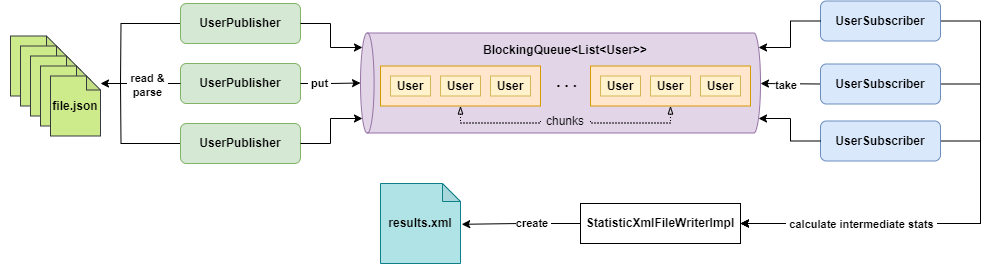
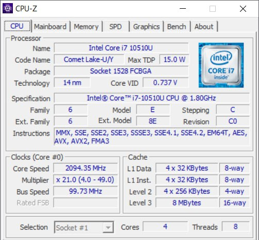
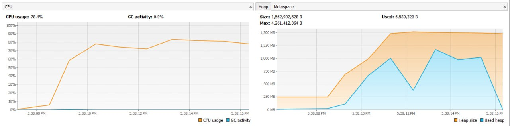

## Used Stack:

- Java 17 and Maven for development.
- JUnit 5, AssertJ, and Mockito for testing.
- Project Lombok and SLF4J with Logback for code simplification and logging.
- Jackson, Commons CLI, JavaFaker, and Gson for data handling.
- JMH for benchmarking.
- Maven plugins (Jar, Shade, Checkstyle, PMD, Compiler, JXR) for build and code quality management.
- JaCoCo Maven Plugin for test coverage, aiming for 80% coverage.

# Setup and Running the Application

Before running the application, you need to build it using Maven. This can be done by executing the following command in
the root directory of your project:

```
mvn package
```

This command will compile your code, run any tests, and package the compiled code into a JAR file in the `target`
directory.

After successfully building the application, you can run it using the following command:

```
java -jar target\user-json-xml-converter.jar -p src/main/resources/json -a categories
```

where `src/main/resources/json` is the path to the directory with JSON files and `categories` is the name of the
attribute for
which you need to calculate statistics.

## System design



The system concept, based on
the [Publisher-Subscriber](https://dsysd-dev.medium.com/system-design-patterns-publisher-subscriber-pattern-ae281d5598f5)
pattern, allows you to create a flexible and efficiently scalable architecture.
In this model, Publishers (JSON file readers) generate data, and Subscribers (User processors) react to these data
without knowing each other, which provides excellent separation and reduces dependencies between system components.
This makes it easier to add new publishers and subscribers, and also improves data flow management, as each component
can handle its own tasks independently.

### Entities:

- `FileLoaderImpl`: This class is responsible for processing files in a specified directory.
  It processes files in the specified directory and returns an array of `File`
  objects. Only files with the “.json” extension are processed. If the directory is empty or does not exist, it throws
  an `InvalidDirectoryException`.
- `User`: An object that represents a user. It has attributes `username`, `email`, `password`,`role` and `categories`.
- `Role`: An Enum that represents the role of a user. It can be `ADMIN` or `USER`.
- `Item`: An object that represents a statistic item. It has attributes `value` or `count`.
- `Statistics`: An object that represents the statistics for a given attribute.
- `StaticticXmlFileWriter`: A class that writes a `Statistics` object to an XML file.
- `InvalidDirectoryException`: This is a custom exception class that extends `IllegalArgumentException`. It is thrown
  when a directory is empty or does not exist.
- `CustomThreadFactory`: This is a custom implementation of the ThreadFactory interface. It allows for customization of
  the created threads, such as setting a name prefix.
  The name of the new thread will be a combination of the specified prefix and an incrementing counter.
- `MainBenchmark`: This class is used for benchmarking the main method of the application. It uses the JMH (Java
  Microbenchmark Harness) framework for benchmarking. The `testMainMethod` function is annotated with `@Benchmark`,
  which indicates that it is the method to be benchmarked.
- `UserSubscriber`: This class is a Runnable that consumes User objects from a BlockingQueue. It processes each user,
  extracting a specified attribute and updating a ConcurrentHashMap with the frequency of each attribute value. The
  processing continues until a PoisonPillUser is encountered in the queue, signaling termination.
- `UserPublisher`: This class is a Runnable that produces User objects and puts them into a BlockingQueue. It reads
  User objects from a JSON file and adds them to the queue in chunks. The size of each chunk is specified by
  chunkSize. The process continues until all User objects are read from the JSON file.
- `CommandLineArgs`: This class is responsible for handling command-line arguments. It expects at least two arguments:
  the directory path and the attribute name. If the number of provided arguments is less than two, it throws
  an `IllegalArgumentException`.
- `FakeDataGenerator`: class is used to generate fake user data and write it to a JSON file.

## Examples of Input and Output Files

- Input files: JSON files, each containing an array of User objects. Each User has attributes username, email, password,
  and role. For example:

```json
{
  "username": "JohnDoe123",
  "email": "johndoe123@example.com",
  "password": "password123",
  "role": "ADMIN",
  "categories": "sports games, sculpture, cats, AI"
}
```

- Output files: XML files that contain statistics for the specified attribute.For example:

```xml

<statistics>
    <item>
        <value>ADMIN</value>
        <count>1</count>
    </item>
    <item>
        <value>USER</value>
        <count>1</count>
    </item>
</statistics>
   ```

# Benchmarking

| Testing stand: |                                                           |
|----------------|-----------------------------------------------------------|
| **OS**         | Windows 10                                                |
| **CPU**        | Intel Core i7 10510U                                      |
| **RAM**        | 16 GB DDR4                                                |
| **Storage**    | 1TB SSD                                                   |
| **JVM**        | JDK 17.0_2, Java HotSpot(TM) 64-Bit Server VM, 25.261-b12 |
| **VM Props**   | -Xms128m -Xmx4096m                                        |



### Testing data:

- 32 .json files
- 4.18 GB
- 25,620,000 json array User class items

### JMH options:

- **Warmup:** 2 iterations, 10 s each
- **Measurement:** 5 iterations, 10 s each
- **Timeout:** 10 min per iteration
- **Threads:** 1 thread, will synchronize iterations
- **Benchmark mode:** Average time, time/op

### Queue and chuck sizes

- 7 publishers
- 1 subscriber
- [1000, 100, 10] queue sizes
- [100 000, 10 000, 1000] queue chunk sizes

```
Benchmark       (queueChunkSize)  (queueSize)  Mode  Cnt   Score   Error  Units
Benchmark.main            100000           10  avgt    5  10.974 ± 1.144   s/op
Benchmark.main            100000          100  avgt    5  12.141 ± 5.095   s/op
Benchmark.main            100000         1000  avgt    5  11.612 ± 2.594   s/op
Benchmark.main             10000           10  avgt    5  11.206 ± 1.811   s/op
Benchmark.main             10000          100  avgt    5  10.292 ± 0.391   s/op
Benchmark.main             10000         1000  avgt    5  10.753 ± 0.681   s/op
Benchmark.main              1000           10  avgt    5  10.207 ± 0.406   s/op
Benchmark.main              1000          100  avgt    5  10.490 ± 0.677   s/op
Benchmark.main              1000         1000  avgt    5  10.284 ± 0.789   s/op
```

Increasing the queue size while keeping the chunk size constant results in only slight variations in execution time,
without any clear trend of increase or decrease.

This may indicate that the program is optimized to work with different queue sizes or that the effect of the queue size
is ambiguous.

Let's take the `queueSize=10` and `queueChunkSize=1000` as the optimal values and test different variations for the
number of Publishers and Subscribers.

```
Benchmark           (Publishers)  (Subscribers)   Mode  Cnt   Score   Error  Units
Benchmark.main             1              7   avgt    3  17.546 ± 1.877   s/op
Benchmark.main             2              6   avgt    3  12.830 ± 1.979   s/op
Benchmark.main             3              5   avgt    3  10.746 ± 2.009   s/op
Benchmark.main             4              4   avgt    3   9.895 ± 2.403   s/op
Benchmark.main             5              3   avgt    3   9.374 ± 3.240   s/op
Benchmark.main             6              2   avgt    3   8.966 ± 2.890   s/op
Benchmark.main             7              1   avgt    3   8.841 ± 1.575   s/op
Benchmark.main             1              1   avgt    3  17.577 ± 0.497   s/op
Benchmark.main             2              2   avgt    3  12.762 ± 2.964   s/op
Benchmark.main             4              8   avgt    3   9.749 ± 1.065   s/op
Benchmark.main             8              4   avgt    3   8.689 ± 2.309   s/op
Benchmark.main             8              8   avgt    3   8.747 ± 1.191   s/op
Benchmark.main            16             16   avgt    3   8.546 ± 0.231   s/op

```

### Use of CPU and memory

  

## Conclusions:

From these data, it is possible to conclude that the most time-consuming operation is reading data from .json files.
The system shows the worst results with the minimum number of publishers. When their number is approximately equal to
the number of cores, we get the fastest results.
The number of subscribers does not greatly affect the result, which can be explained by the fact that operations "
inside" the Java are much faster than reading files using I\O.
